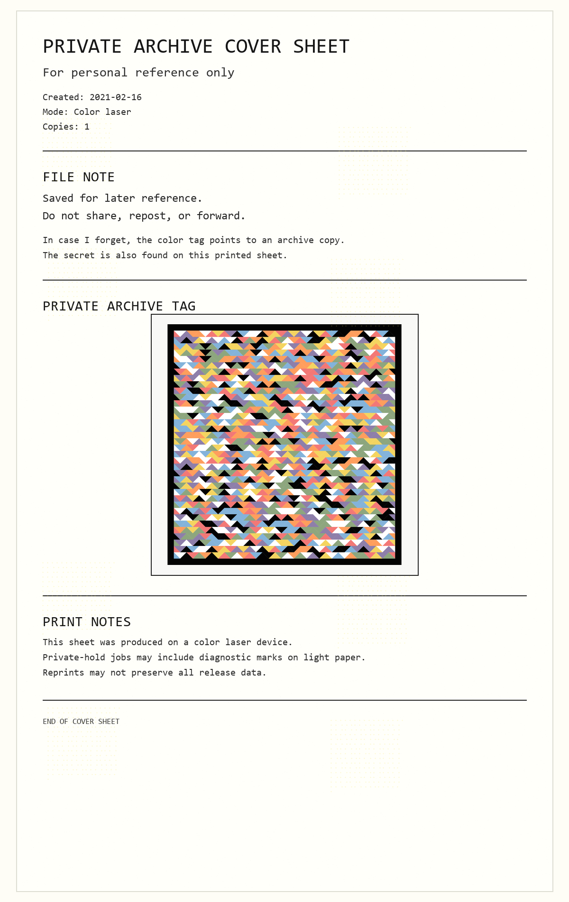
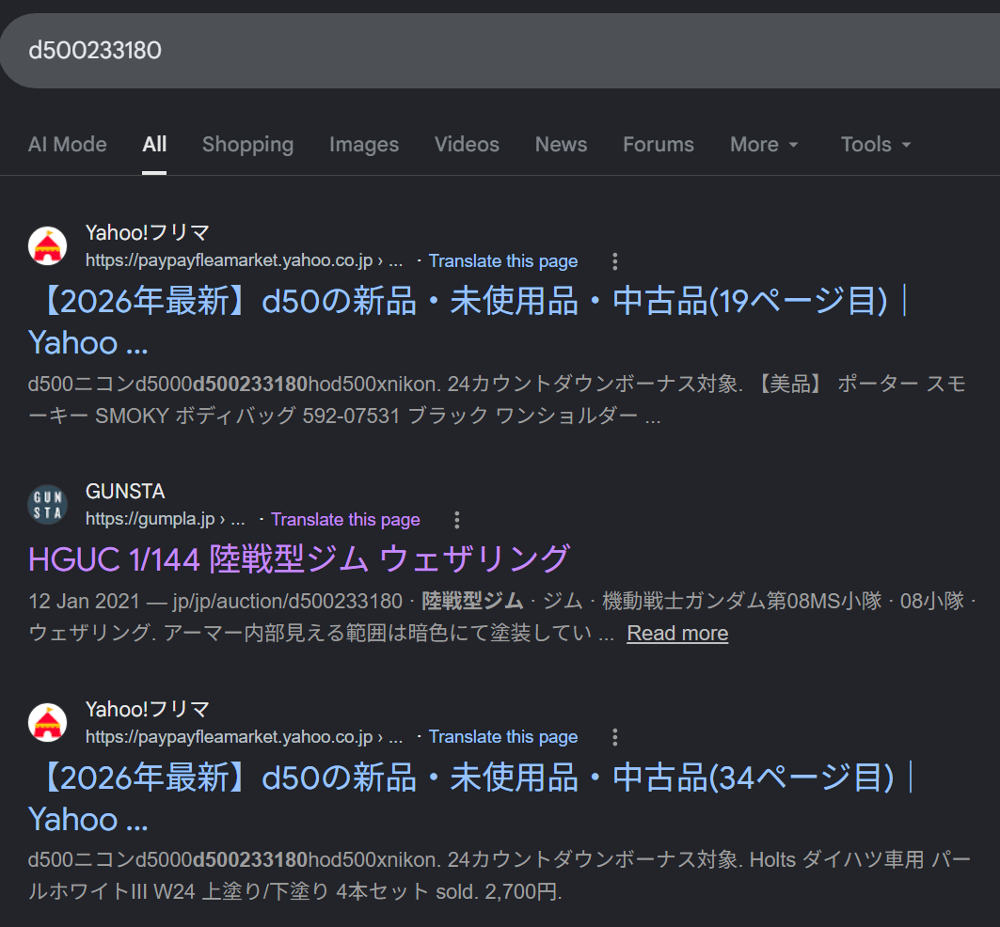
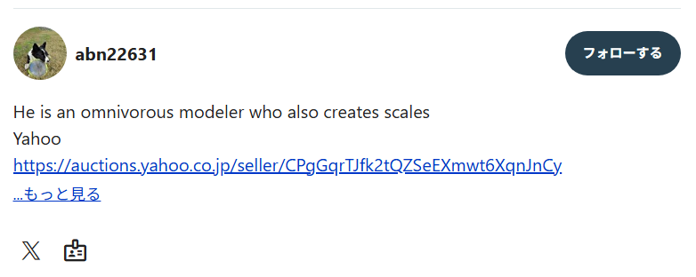
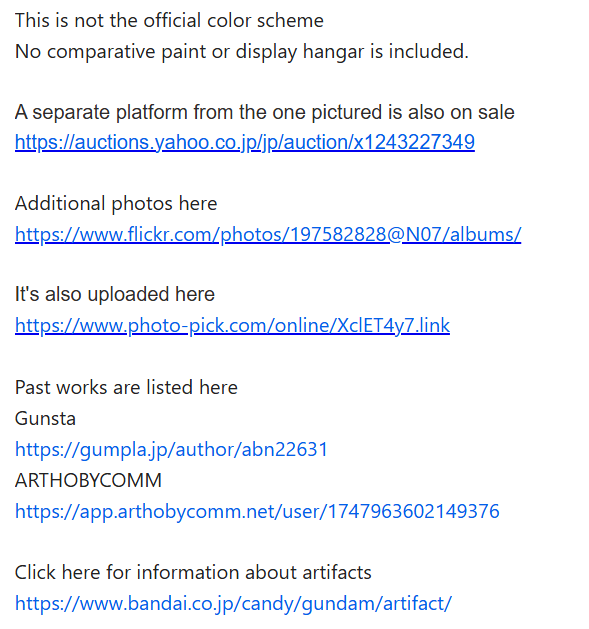
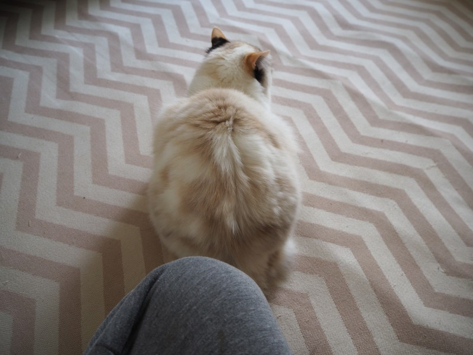
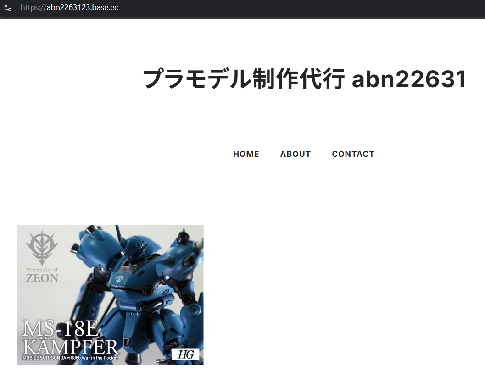

# My Printer has a Secret

The sheet offered two clues: yellow printer dots and an unusually colourful patch of triangles. The dots supplied an archive password; the triangles supplied its URL. Inside the archive waited an OSINT scavenger hunt.



## Read the sheet

The yellow marks form repeated 15×15 grids like [printer tracking dots](https://en.wikipedia.org/wiki/Printer_tracking_dots). Treat the row and column marks as synchronization, then read the remaining dots as one bit stream: **dot present = 0**, **dot absent = 1**. Eight bits at a time produce:

```text
sut0roberi1-fure!b4a_*=^
```

The triangles use eight colours, enough for three bits each. Reading them in order with this mapping reveals the archive address:

| Colour | Bits | Colour | Bits |
|---|---|---|---|
| Red | `000` | Green | `100` |
| White | `001` | Blue | `101` |
| Purple | `010` | Yellow | `110` |
| Black | `011` | Orange | `111` |

```text
<ihttps://printer-secret.chals.tisc26.ctf.sg/Fn8u92fhuiWAfeAfGu23dy.zip
  ^^^^^^^^^^^^^^^^^^^^^^^^^^^^^^^^^^^^^^^^^^^^^^^^^^^^^^^^^^^^^^^^^^^^^^^
```

The leading characters are noise; the `https://` address is the useful part. The password-protected archive contains `printer-secret-part2.txt`, which turns the solve toward a deleted auction listing.

## Follow the seller

The archive asks for the Flickr username behind auction `d500233180`, plus two details from the seller's online presence. A [Gumpla post](https://gumpla.jp/hg/634645) led to the seller's profile:





Another Yahoo auction listing connected that profile to a Flickr account and a [model-hobby profile](https://app.arthobycomm.net/user/1747963602149376):



The Flickr username is `abn2263123`. The hobby profile banner shows grey pants, and the seller's [shop](https://abn2263123.base.ec/) features an MS-18E model.





Put the three answers together:

```text
TISC{abn2263123_grey_MS-18E}
```
