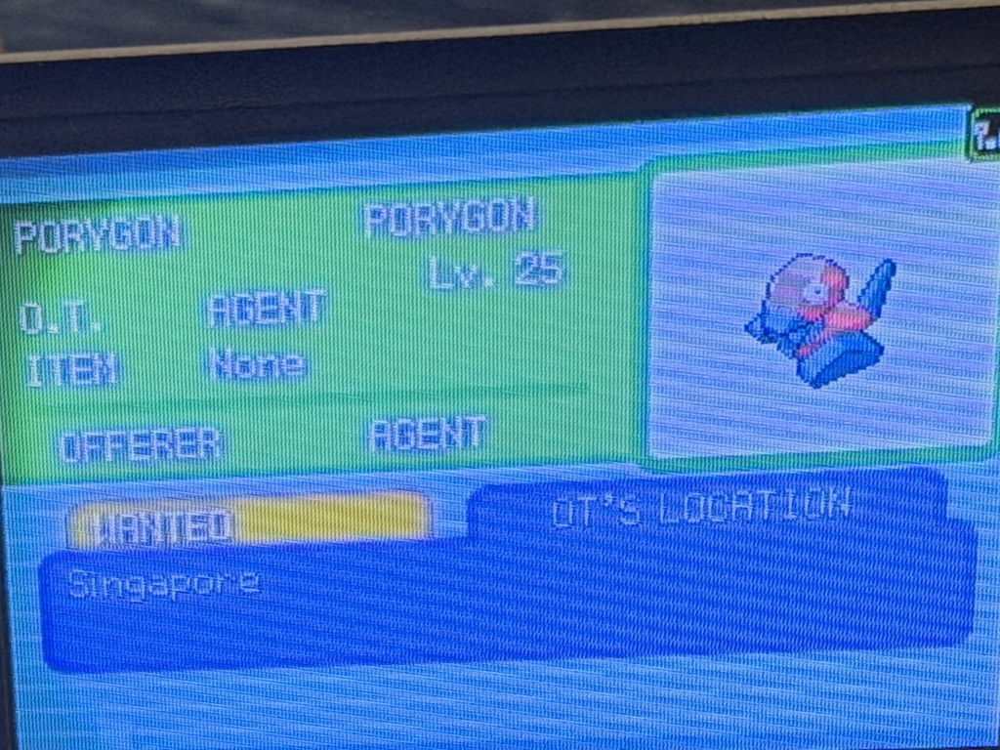
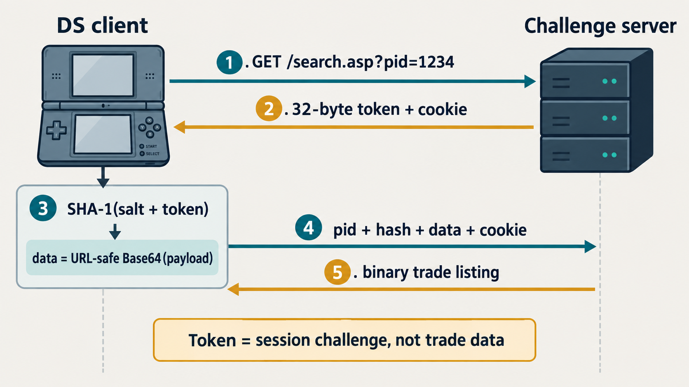
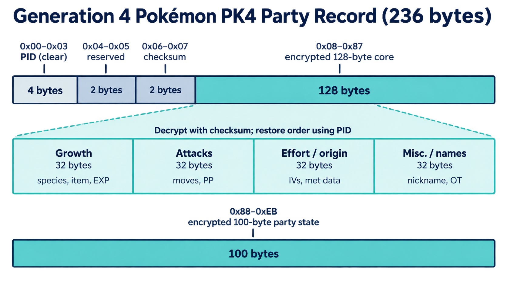
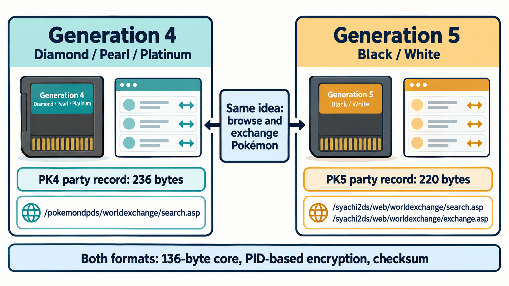
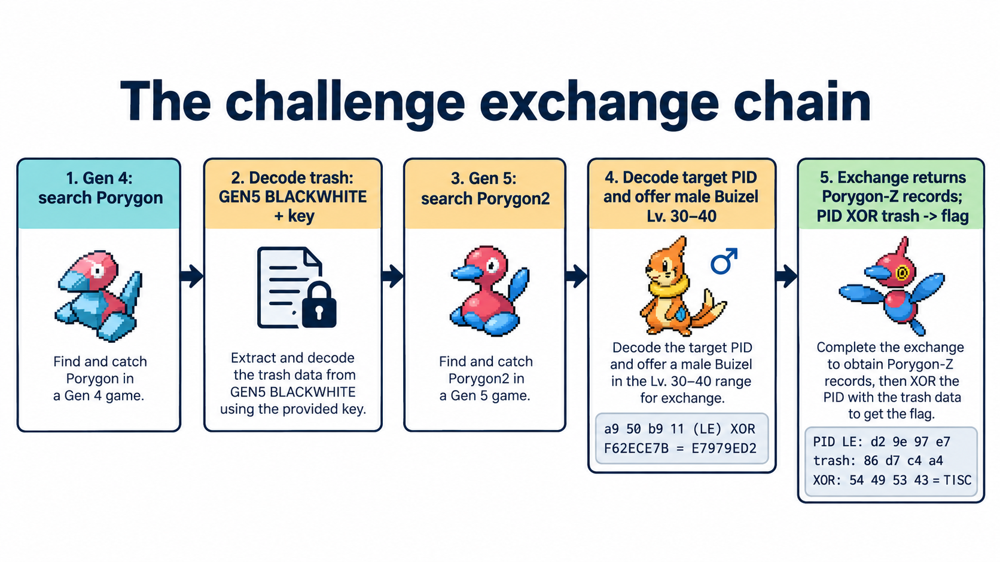

# Trash Talk

The photo shows a Pokémon Platinum GTS screen. It points to an old exchange protocol, but the real messages are hidden in bytes the game ignores after a nickname ends. The solve crosses Generation 4 and 5 records, trades a valid Buizel, and assembles a flag from three returned Pokémon.



## Speak GTS

The challenge service at `chals.tisc26.ctf.sg:31259` expects the legacy host `gamestats2.gs.nintendowifi.net`. Its useful routes are the Gen-4 `.../pokemondpds/worldexchange/search.asp` and Gen-5 `.../syachi2ds/web/worldexchange/{search,exchange}.asp` endpoints.



Each action starts with `endpoint?pid=<client id>`. The reply supplies a 32-byte token and session cookie; the second request sends the cookie, Base64 action data, and `SHA1(game_salt || token)`. The salts and message format are public, so this is framing rather than strong authentication.

Results are binary Pokémon records. A Gen-4 listing embeds a 236-byte PK4 party record; Gen 5 uses a 220-byte PK5 inside a 296-byte GTS wrapper. Pokémon PID, checksum, block permutation, and encryption all matter. The HTTP `pid`, Pokémon PID, and listing ID are different values.





## Follow the exchange chain



**1. Search Gen 4 for Porygon (species 137).** One response holds at most seven listings, while the challenge has ten. Repeat the search and deduplicate by the listing ID at offset `0x108`. Decrypt the embedded PK4 records and look past the nickname's `ff ff` terminator. The ignored bytes spell:

```text
G3N5_BL4CKWH1T3;P0RYG0N2_TR4SH=P1D_L3_X0R_K;K=<live key>
```

`K` changes between sessions, so the script reads it from the current listings.

**2. Search Gen 5 for Porygon2 (species 233).** The five outer listings include two impostors: their decrypted inner records are Ditto nicknamed `NOT ME!`. The other three have OT strings that combine into `0FF3R_M | BU1Z3L | Lv30-40`: offer a **male Buizel at level 30–40**.

Their nickname trash encodes three hidden target PIDs. Interpret each four-byte value as a little-endian integer, then XOR it with `K`. In one captured session, `0x11b950a9 XOR 0xf62ece7b = 0xe7979ed2`. The targets are `e7979ed2`, `b618a9cf`, and `ddfc445a`.

**3. Make the trades.** Build a valid Gen-5 male Buizel at level 30, perform an ordinary Porygon2 search to establish state, then send a 432-byte `exchange.asp` request:

```text
0x000..0x127  296-byte offered Buizel record
0x128..0x12b  hidden target PID, little-endian
0x12c..0x1af  132-byte validation area (zeroes work here)
```

Each hidden target returns a 296-byte Porygon-Z record. No finish request is needed; the flag is already in those records.

**4. Decode the answer.** XOR the 16 nickname-trash bytes of each returned record with its Pokémon PID repeated as four little-endian bytes:

```python
pid_le = struct.pack('<I', returned_pid)
chunk = bytes(b ^ pid_le[i % 4] for i, b in enumerate(trash))
```

The three chunks are `TISC{p0lyg0n4l_p`, `1d_ch41n_4cr0ss_`, and `g3ns}`. Together:

```text
TISC{p0lyg0n4l_p1d_ch41n_4cr0ss_g3ns}
```

## Reproduce it

`python3 solve.py` performs the handshake, record decryption, searches, exchanges, and final XOR. The three decisive exchange responses are included as `hidden-target-*.bin` downloads.

For the real protocol and record formats, see [Project Pokémon's Wi-Fi protocol notes](https://projectpokemon.org/home/docs/other/wi-fi-protocol-structure-r88/), [Gen-5 GTS research](https://projectpokemon.org/home/forums/topic/12624-5th-gen-gts-research/), [PK5 structure](https://projectpokemon.org/docs/gen-5/bw-save-structure-r60/), and the [PKHeX PK4 implementation](https://github.com/kwsch/PKHeX/blob/master/PKHeX.Core/PKM/PK4.cs). The challenge-specific records and behavior came from the challenge service.
