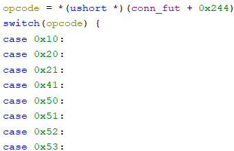
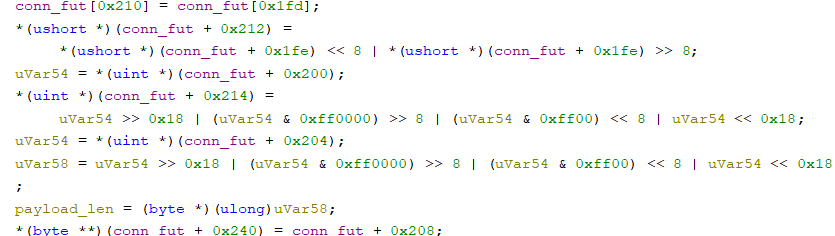
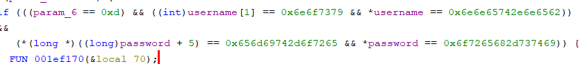
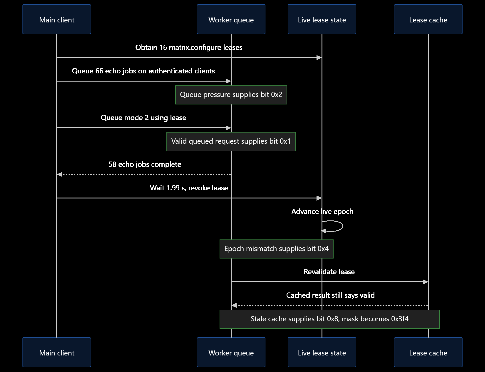

# Omnitrix

The service guards a flag helper behind a one-time 16-character challenge. We could not read the helper, so the plan was to make the Omnitrix service run our code, talk to the helper, and carry its answer back through the service's own reply format.

## Find the moving parts

`omnitrix` speaks a binary TCP protocol. Its 16-byte header starts with `OMNI`, then version, class, opcode, request ID, and body size; multi-byte fields are big-endian. Request IDs matter because background jobs reply out of order. The useful opcodes cover login (`0x0010`), lease creation/revocation (`0x0020`/`0x0021`), transforms (`0x0041`), mode changes (`0x0050`), diagnostics (`0x0051`), and replay (`0x0053`).





The challenge analysis reveals login `ben.tennyson` / `its-hero-time`:



A *lease* is a 16-byte temporary permission ticket. `matrix.configure` changes mode, `dna.shift` handles transform/upload jobs, and `omnitrix.scan` handles replay. Harmless probes showed that upload and replay need policy bits `0x150`, absent from ordinary mode 2.

## Race the permission snapshots

The mode-change worker combines facts captured at different times. It grants the stronger policy when the queued request was valid, at least 64 jobs remain outstanding, the lease epoch has changed, **and** the old lease still appears valid in a cache. That contradictory last pair is the bug. All four conditions set mask `0xf`, changing mode-2 policy from `0x2a4` to `0x3f4` and enabling the missing `0x150` bits.



The reliable timing sequence was:

1. Acquire 16 `matrix.configure` leases, plus one `dna.shift` and one `omnitrix.scan` lease.
2. Open 66 authenticated clients and queue an `echo` transform from each.
3. Queue a mode-2 request with the first matrix lease.
4. After 58 blocker jobs finish, wait 1.99 seconds and revoke the **last** matrix lease, leaving the queued request's lease alone.
5. Try a harmless upload and replay. A policy error means the timing missed; restart with fresh connections.

Counting completed jobs matters more than sleeping a fixed time from startup, because the window follows worker progress.

## Turn upload into execution

With the raced policy, `codon.stream.inject` writes chosen files under `/tmp/omnitrix/codon/`. A replay file has this structure:

```text
"OREP" || u16be(1) || lp(form) || lp(template) || u16be(entry_count)
       || repeated (lp(key) || lp(value))
```

First, an ordinary `merge` replay with `payload = replay-ok` confirms the upload and recall path. Then an `engage` replay names the uploaded `probe.so`. The engage path calls `dlopen` and invokes the library's `omnitrix_probe` symbol: a transform input has become native code.

The module filter looked for dangerous imports, strings, and code shapes. The library imported bland file operations, found libc from `open` at runtime, parsed its in-memory ELF symbol table, and resolved obfuscated names such as `fork`, `execve`, and `waitpid` only after loading.

The helper is execute-only. The probe enumerated executables at `/`, ran candidates with pipes, and recognized the helper by its initial 16 hexadecimal characters. It echoed that fresh token back, received the flag, and saved the output inside a normal OREP `merge` record at `replay/result.orep`. A final `0x0053` recall brought the answer back without disrupting the framed TCP protocol.

## Reproduce it

Build the library, then run the solver against the authorized local connector:

```bash
gcc -shared -fPIC -O2 -fno-stack-protector \
  -U_FORTIFY_SOURCE -D_FORTIFY_SOURCE=0 \
  -Wl,--build-id=none -Wl,-soname,probe \
  -o exploit.so exploit.c
strip --strip-unneeded exploit.so

python3 solve.py 127.0.0.1 7878 \
  --binary ./omnitrix --matrix-burst 16 --race \
  --blockers 66 --race-revoke matrix-other \
  --revoke-after-successes 58 --revoke-delay 1.99 \
  --probe-so ./exploit.so --show-result
```

The expected milestones include `blockers_echo_result=58` and `callback_result_received=True`. The recovered flag was:

```text
TISC{6r33n_n33dl3_0r_br41n5t0rm??}
```
