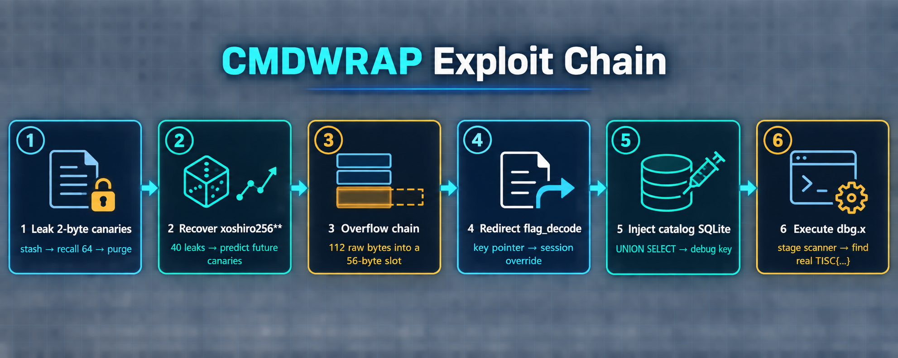
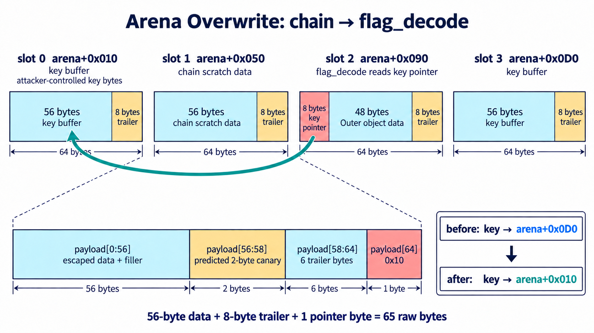
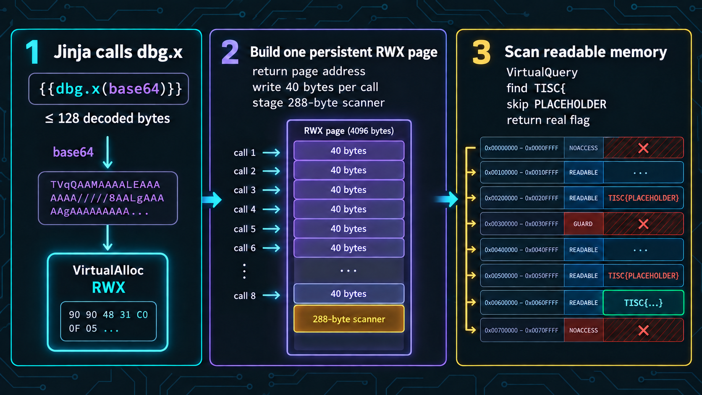

# cmdwrap

The service offers a tiny command shell whose powers arrive as downloadable DLL “capabilities.” One capability leaks an arena canary; another copies twice as many bytes as it reserved. From there the path winds through a catalog SQL injection and a hidden debug worker that will execute small pieces of machine code.



## The shell behind the shell

The TCP broker at `cmdwrap.chals.tisc26.ctf.sg:4444` accepts commands such as `add_capability`, `stash`, `recall`, `chain`, and `flag_decode`. It requests DLLs from a private HTTP *catalog*, saves them in the session sandbox, and loads them with `LoadLibraryA`. Loading `file_download` lets us retrieve those saved DLLs for analysis.

Each connection has a UUID. Normally the catalog receives that UUID as its session string, but a buffer at `arena+0x10` can temporarily override it. This otherwise obscure override becomes our route into the catalog and debug worker.

The broker's 4 KiB arena uses 64-byte slots: **56 data bytes, a two-byte canary, then six trailer bytes**. `stash` fills a slot; `recall 0 64` can print all 56 data bytes *and* its trailer. The canary is simply `int.from_bytes(raw[56:58], 'little')`. Repeating stash, recall, and purge yields consecutive canaries. `predict_canary.py` recovers the underlying `xoshiro256**` state and predicts later ones.

## A short allocation, a long copy

`chain` executes semicolon-separated commands. Its length scanner counts an escaped pair such as `\A` as one logical byte, but its copy loop copies both raw bytes. Fifty-six escaped pairs therefore pass a 56-item check while writing up to 112 bytes into a 56-byte slot.

The allocator's recycle list makes the overwrite predictable:

```text
stash 41          → occupy slot 1
flag_decode A     → allocate Outer in slot 2 and key in slot 3
stash purge 0     → free slot 1
chain <overflow>  → reuse slot 1 and reach slot 2
```



The 65th raw byte changes the low byte of `Outer.key_pointer` from `0xd0` (the key slot) to `0x10` (the catalog-session override). `flag_decode` follows that pointer and copies its argument there. Its normal 55-byte limit is stretched by loading the DLL under several aliases: the broker treats a non-breaking space as part of a raw name, while the catalog trims it. Independent DLL instances write consecutive 55-byte pieces at `arena+0x010`, `+0x047`, `+0x07e`, and `+0x0b5`, making a continuous value up to 220 bytes.

## Ask the catalog the wrong question

The catalog concatenates the selected session into SQLite. The TCP parser splits at ordinary spaces, so the injected SQL uses tabs instead:

```text
'\tUNION\tSELECT\tjson_group_array(json_array(key,hint,notes))
\tFROM\tdebug_info--
```

The result comes back where DLL bytes should be. Loading it fails, but the broker leaves the text file in the sandbox and `file_download` retrieves it. The useful row contains a deployment-specific `dbg_...` key and says to prepend `:<key>:` to the session UUID.

That prefix activates a hidden catalog debug worker. Text after the keyed UUID becomes a Jinja template with a `dbg` object. Its `dbg.x` method accepts Base64-encoded x86-64 bytes, allocates executable memory, runs them, and returns `RAX`.

## Grow past the 128-byte limit

`dbg.x` accepts only 128 bytes per call, but Windows rounds its `VirtualAlloc` allocation to a page and the worker does not free it. Several short calls write 40-byte pieces into one persistent executable page. The staged 288-byte scanner uses `VirtualQuery` to skip unreadable regions, then searches committed readable memory for `TISC{`.



The returned address is read eight bytes at a time until `}`. The flag is:

```text
TISC{h0pe_YoU_5tiLL_h@ve_t0k3ns_L3ft}
```

## Reproduce it

From the `solution/` directory, `python3 solve.py` runs the canary prediction, override, SQL query, debug-worker staging, and memory scan against the challenge endpoint. It imports the accompanying scripts and reads `scan_flag_memory.bin`; all are included in the downloads.
