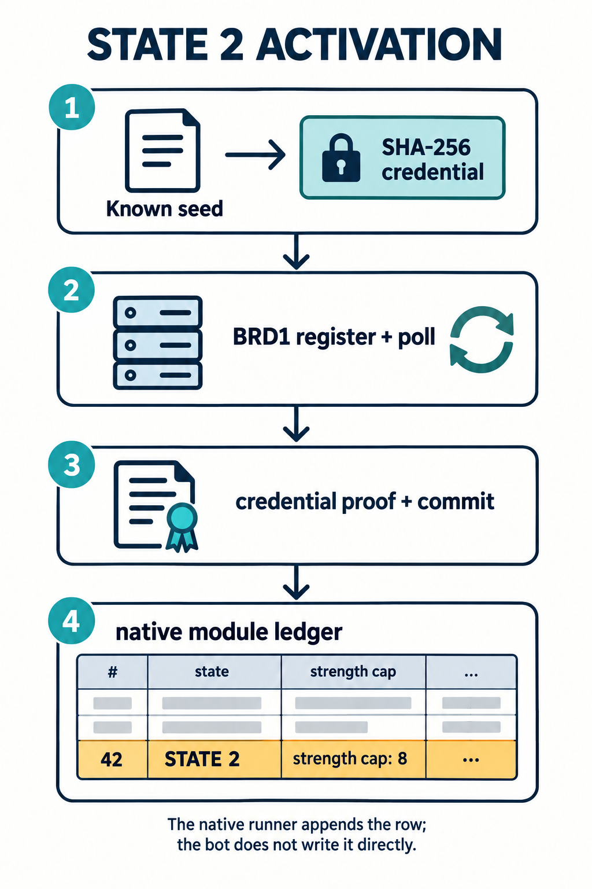
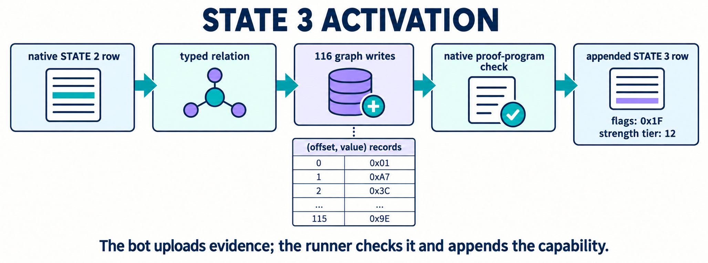
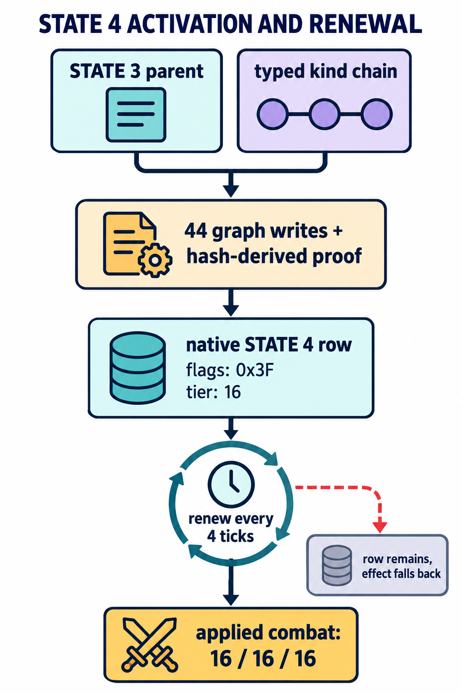
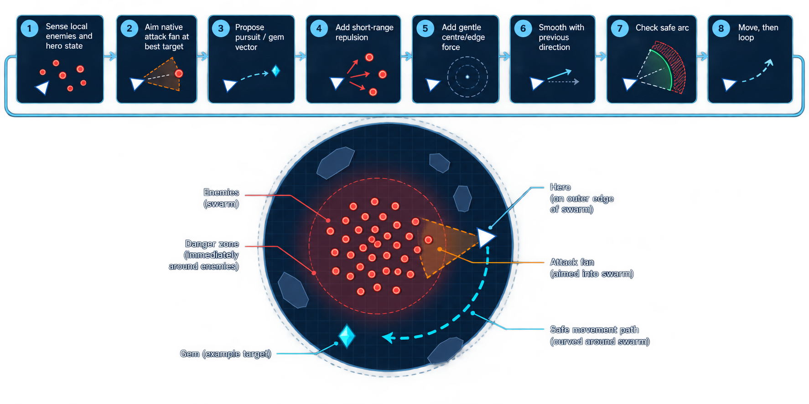

# EXPcalibur

The obvious game loop was only half the machine. A special `EXPCDV4` file header unlocked a device protocol inside the runner; that protocol could build attack, defense, and utility capability rows. The final bot kept all three channels at **16/16/16**, survived the ten-minute run, and scored **590,964 EXP** at level 104 with 18,661 kills.

The interactive trace below lets you step through the device transactions. The rest of this report explains how the bot reached that state and what it did once empowered.

## The hidden device

The runner accepts a 32-byte `EXPCDV4` prefix before normal VM bytecode. It holds version and protocol `4`, reserved bytes, and the first four bytes of a SHA-256 check over the header. This enables VM opcode `0x21`, `board`. A zeroed board request returns device status only in that mode; the header is an integrity format, not a secret signature.

`board(address)` copies a checked `BRD1` descriptor from guest memory into a native transaction executor. The descriptor carries a request counter, slot, combat kind, ticket, 64-byte device payload, guest input/output addresses, and flavor. Its input is a sequence of 32-byte transaction records. The record opcode chooses what the remaining words mean: opcode 6 writes graph dwords, while later records close and validate transactions.

The terms matter: **kind** is attack (`0`), defense (`1`), or utility (`2`); **flavor** is one of sixteen payload variants; **slot** addresses a native ledger route; a **ticket** is a request/session object, not the capability itself. The runner checks a 64-byte payload with row, column, and rolling-hash constraints. There are 48 valid kind/flavor combinations. The bot tries flavors through register, poll, and an initial `[7,8]` pair, then trusts the resulting native capability byte rather than a syntactically valid ticket.

## Rebuild the graph's moving parts

The live seed is not handed to device mode. Legal rectangle scans fingerprint the first enemy wave and identify one of seven fixed layouts. The bot hashes its own submitted file as well: the seed determines 16-bit graph tokens, while a digest word determines file-bound scheduling context. The graph shape stays stable, but raw token words change with the seed.

An offline trace of the supplied runner preserved a canonical 0x400-byte graph buffer. Normalizing each raw token to its index in the current 0x80-byte native token table turned that dump into **116 sparse dword writes**. The submitted VM recreates the live tokens and uploads those writes eight records per `board` call. Opcode 6 fills pending graph memory; a coherent opcode-7/opcode-8 pair makes the native runner execute and validate it. The graph performs 63 visits: 62 proof-producing operations and a terminator.

State 2 first needs a credential-bearing transaction sequence.



State 3 then needs a matching State-2 row at phase `0x0f`; after graph validation, the runner publishes State 3 at phase `0x1f`.



State 4 adds a **44-dword delta** over the graph bank and three dynamic proof words at offsets `0x2c`, `0x34`, and `0x3c`. SHA-256 context and a small modular linear solve generate those words; the native verifier compares a 163-row relation transcript. State 4 is constructed by the runner after this proof, not written directly by the VM.

Its compact ledger row persists, but the combat effect lasts only about eight resolver ticks. Two authenticated, typed `[7,8]` pairs every four ticks renew it.



## Three channels, one applied profile

Attack, defense, and utility have separate rows. The useful ledger holds State-3 phase `0x1f` and State-4 phase `0x3f` for kinds `0`, `1`, and `2`. The last utility relation needs dependency tuple `(2,4,1,4)`; the near miss `(2,4,1,3)` does not work.

When all three relations are live, the resolver reports `(attack, defense, utility, lease_valid) = (16,16,16,1)`. Observed effects include attack fanout and reach, defense and invulnerability, stronger movement, and a larger pickup radius. Durable rows alone are insufficient: the bot must keep renewing the applied combat profile.

## Drive the empowered bot

The controller takes a distance-sorted enemy sample each tick. It prefers a type-8 target when present, otherwise the nearest one, and aims the native attack fan through the densest useful pack. For movement it blends target or gem pursuit with short-range contact repulsion, gentle edge correction, and late-game one-tick inertia. A local look-ahead compares direct and slightly turned paths, keeping the hero near the outside of a crowd: close enough for fanout, far enough to avoid contact.



The bot measures the displacement of its first legal move before a second move call, because walls and contacts can shorten the first. On selected late-game seed rows it skips that second move when a denser pack scored better. The policy was tuned for the fixed seven-seed median, not claimed as a universal strategy.

## Reproduce the artifact

`evidence/build-bot.py` needs only `bot-base.bin` and `bot-base.json` beside it. From the challenge directory:

```bash
python3 evidence/build-bot.py
sha256sum evidence/final-bot.bin
# 57bde4da73c114fe8d1e750c157759cb0e05a260bcd81f337b6a75af3ec0ccc9
```

The builder changes an inert final-table nonce and updates the saved SHA-256 chaining block the bot checks at runtime. The runner, canonical graph dump, and trace script are supplied as separate downloads for a deeper reproduction. The final result was checked against unchanged-runner traces, ledger and applied-strength snapshots, and complete deterministic runs over the recovered seeds.
